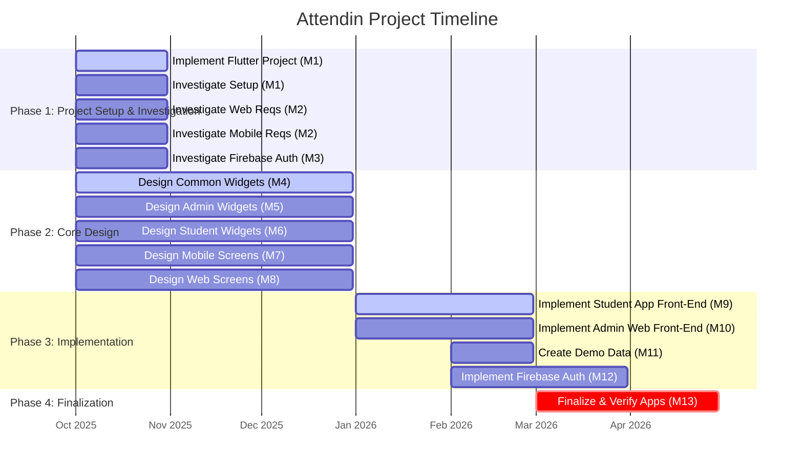

```mermaid
gantt
    title Attendin Project Timeline
    dateFormat  YYYY-MM-DD
    axisFormat  %b %Y

    section Phase 1: Project Setup & Investigation
    Implement Flutter Project (M1)          :active, m1, 2025-10-01, 2025-10-31
    Investigate Setup (M1)                  :m1_2, 2025-10-01, 2025-10-31
    Investigate Web Reqs (M2)               :m2, 2025-10-01, 2025-10-31
    Investigate Mobile Reqs (M2)            :m2_2, 2025-10-01, 2025-10-31
    Investigate Firebase Auth (M3)          :m3, 2025-10-01, 2025-10-31

    section Phase 2: Core Design
    Design Common Widgets (M4)              :active, m4, 2025-10-01, 2025-12-31
    Design Admin Widgets (M5)               :m5, 2025-10-01, 2025-12-31
    Design Student Widgets (M6)             :m6, 2025-10-01, 2025-12-31
    Design Mobile Screens (M7)              :m7, 2025-10-01, 2025-12-31
    Design Web Screens (M8)                 :m8, 2025-10-01, 2025-12-31

    section Phase 3: Implementation
    Implement Student App Front-End (M9)    :active, m9, 2026-01-01, 2026-02-28
    Implement Admin Web Front-End (M10)     :m10, 2026-01-01, 2026-02-28
    Create Demo Data (M11)                  :m11, 2026-02-01, 2026-02-28
    Implement Firebase Auth (M12)           :m12, 2026-02-01, 2026-03-31

    section Phase 4: Finalization
    Finalize & Verify Apps (M13)            :crit, m13, 2026-03-01, 2026-04-30
```